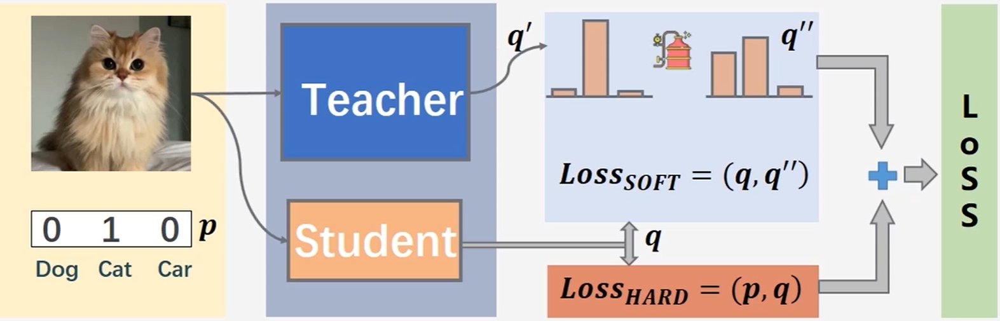

1. 参数量化
    - 不改变模型结构
    - 改变模型参数的数据格式   
        - 减小参数精度
            - 动态量化（模型训练后）: float 输入必经 QuantStub 变为 int，此后到输出之前都是 int
            - 静态量化（模型训练后）：
                - float 输入是经动态计算的 scale 和 zp 量化为 int，op 输出时转换回 float
                - 与动态量化的本质区别，op和op之间是否需要转回`float tensor`。
            - 量化感知训练（训练过程中）:边训练边量化，一种比静态量化更优的量化方式，但量化时间会更长，但精度几乎无损
        - 参数聚类
        - 二值化
        
2. 剪枝
    - 剪枝技术是通过将大模型中一些"不重要"的连接剪断，得到一个"稀疏"结构的模型。剪枝又分为"结构性剪枝"与"非结构性剪枝"。剪枝可以作用在权重粒度， 也可以作用在attention heads / layer粒度上
    - 剪枝后的网络使用原初始化参数初始化后重新训练会取得原型类似的性能，但在随机重初始化后重新训练会表现的更糟糕
    - 非结构化剪枝 可以是局部剪枝，也可以通过调用global_unstructured进行全局剪枝
    - 结构化剪枝只能局部剪枝，不能直接全局剪枝，需要人工指定需修剪的层
    - 非结构化剪枝不能提升模型推断速度，因为稀疏矩阵大小未变，依然是矩阵运算：部分权重置0后，仍然需要补全位置后运算
    
3. 知识蒸馏
    - 将大模型的输出当作小模型训练时的标签来用，即训练一个小模型(student)来学习大模型(teacher)，即**软化**训练集的标签
    - 为了更进一步提升效果，还需要小模型学习大模型的中间层结果、Attention矩阵、相关矩阵等，所以一个好的蒸馏过程通常涉及到多项loss，如何合理地设计这些loss以及调整这些loss的权重，是蒸馏领域的研究主题之一
    - 从有部分信息量的负标签中学习 --> 温度要高一些
    - 防止受负标签中噪声的影响 --> 温度要低一些
    - 温度`T`的选择和“学生模型”的大小有关；“学生模型”参数量比较小的时候，相对比较低的温度就可以了（因为参数量小的模型不能capture all knowledge，所以可以适当忽略掉一些负标签的信息）
    - 

4. 模型结构重构

5. 推断加速

---
### Filtered Reference
1. [微软NNI](https://nni.readthedocs.io/zh/latest/Compression/Overview.html)
2. [pytorch](https://pytorch.apachecn.org/docs/1.7/)
3. [keras-surgeon]()