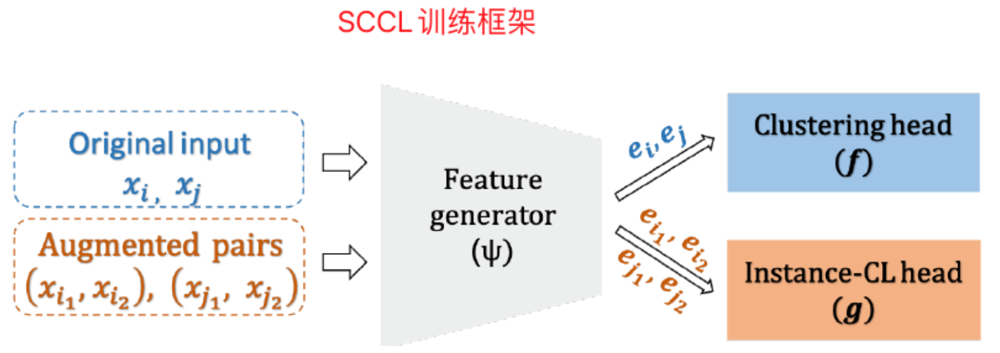

1. 短文本聚类的问题
    - 如果学习过程开始时，不同类别的表示空间彼此重叠，那么学习的过程很难将各类区分开。
    - 解决方式：[对比学习](../10_data_preprocessing/README.md)
    
1. SCCL模型的原理
    - 无监督聚类+对比学习：在基于距离的聚类方法上，使用逐例对比学习区分不同类别。通过联合优化逐例对比学习的损失和聚类的损失，使得模型在拉开距离的同时保证类内距离更近
    - 使用了数据增强，并利用了对比学习去优化增强的数据。相对应的，模型针对Clustering有一个损失函数对源数据进行优化，Instance-CL有一个损失函数对增强数据进行优化
    - 
    
- [Supporting Clustering with Contrastive Learning](https://arxiv.org/pdf/2103.12953.pdf) 