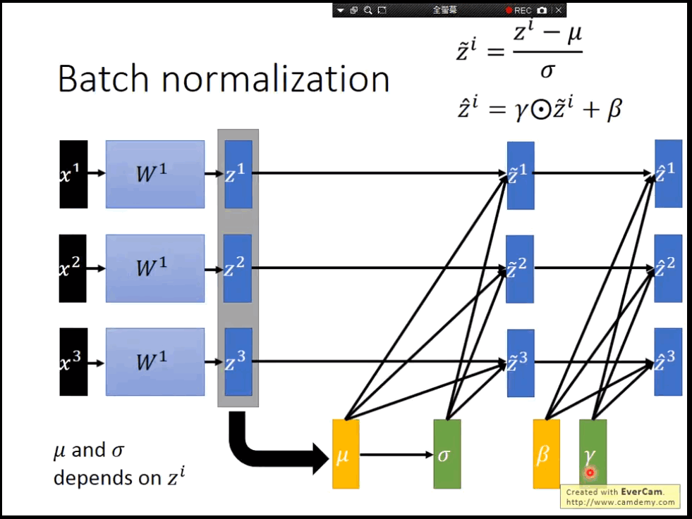

1. BN层为什么有效，BN对梯度消失与爆炸的作用
    - 计算过程
        - 
    - 在每层的BP过程中，增加基于标准差的矩阵对权重进行缩放：权重小时方差大，对权重进行放大，避免梯度衰减，反之对权重进行缩小，避免梯度爆炸；整体使得梯度训练可以加快收敛
    - 使得深层网络也可以被学习，原因同上
    - 减少Internal covariate shift，可以使用较大的学习率，提高训练效率
    - 减轻权重初始化对训练的影响
    - 减少模型对正则化的需求

2. BN训练和测试时的参数是一样的么
    - BN在训练时，是对每一批的训练数据进行归一化，也即用每一批数据的均值和方差。而在测试时，比如进行一个样本的预测，就并没有batch的概念，因此，这个时候用的均值和方差是全量训练数据的均值和方差，这个可以通过记录训练时的均值和方差，然后通过移动平均法求得。
    - 当一个模型训练完成之后，它的所有参数都确定了，包括均值和方差，gamma和bata

3. 为什么在NLP领域中，LN比BN更合适
    - 如果我们将一批文本组成一个batch，那么BN的操作方向是，对每句话的第一个词进行操作。但语言文本的复杂性是很高的，任何一个词都有可能放在初始位置，且词序可能并不影响我们对句子的理解。而BN是针对每个位置进行缩放，这不符合NLP的规律
    - 由于一个mini batch中的每个句子长度不一致，存在paddding，对列缩放的话会造成误差
    - LN针对单个样本进行，不依赖于其他数据，因此可以避免BN中受到mini-batch数据分布影响
    - LN不需要保存mini-batch的均值和方差，节省了额外的存储空间
   
4. BN vs LN
    - todo
    
5. dropout为什么可以防止过拟合
    - todo

6. dropout与Bagging的差别
    - todo
    
7. dropout有什么缺陷
    - dropout一大缺点就是代价函数**J**不再被明确定义，每次迭代，都会随机移除一些节点，如果再三检查梯度下降的性能，实际上是很难进行复查的。定义明确的代价函数**J**每次迭代后都会下降，因为我们所优化的代价函数J实际上并没有明确定义，或者说在某种程度上很难计算，所以我们失去了调试工具来绘制这样的图片。推荐的做法是关闭dropout函数，将keep-prob的值设为1，运行代码，确保**J**函数单调递减。然后打开dropout函数，希望在dropout过程中，代码并未引入bug。
    
5. 过拟合的对应策略
	- Regularization：数据量比较小会导致模型过拟合, 使得训练误差很小而测试误差特别大。通过在Loss Function 后面加上正则项可以抑制过拟合的产生。缺点是引入了一个需要手动调整的hyper-parameter。
	- Dropout：这也是一种正则化手段，不过跟以上不同的是它通过随机将部分神经元的输出置零来实现。
	- Unsupervised Pre-training：用Auto-Encoder或者RBM的卷积形式一层一层地做无监督预训练, 最后加上分类层做有监督的Fine-Tuning。
	- Transfer Learning（迁移学习）：在某些情况下，训练集的收集可能非常困难或代价高昂。因此，有必要创造出某种高性能学习机（learner），使得它们能够基于从其他领域易于获得的数据上进行训练，并能够在对另一领域的数据进行预测时表现优异。
	
7. batch_size的选择策略
    - 合理的batch_size可以提高内存利用率，大矩阵乘法的并行化效率提高；跑完一个epoch的时间减少，减少相同数据的处理速度；一定范围内，batch_size越大，确定的梯度下降方向越准，引起的训练震荡越小
    - 过大的batch_size导致内存爆满；需要达到同样精度所需的epoch次数增大
    - 过小的batch_size由于各个batch之间的差异性，每次梯度的修正可能互相抵消，即震荡，无法收敛

---
### Filtered Reference
1. [深度学习中 Batch Normalization为什么效果好](https://www.zhihu.com/question/38102762/answer/391649040)
2. [详解深度学习中的Normalization，BN/LN/WN](https://zhuanlan.zhihu.com/p/33173246)
3. [Batch Normalization - 李宏毅](https://www.bilibili.com/video/BV1bx411V798?from=search&seid=7639508923003539273)