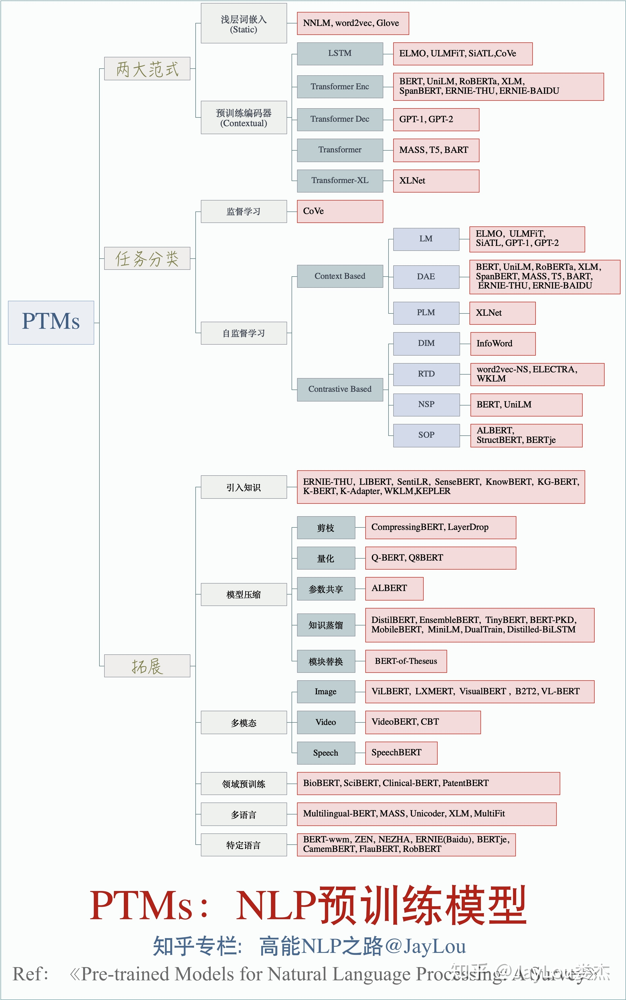

1. 预训练模型概述
    - 
    
2. 预训练模型的目的
    - 在庞大的无标注数据上进行预训练可以获取**更通用的语言表示**，并有利于下游任务
    - 为模型提供了一个**更好的初始化参数**，在目标任务上具备更好的泛化性能、并加速收敛
    - 是一种**有效的正则化手段**，避免在小数据集上过拟合（一个随机初始化的深层模型容易对小数据集过拟合）
    
4. 预训练方法的两种基本范式是什么
    - 自回归语言模型（AR/LM），适用NLG任务
        - 单方向计算某个词出现的概率，以RNN为代表（为基础构建）的模型：ELMo、GPT等，缺点：只考虑词的上文信息，反向的只考虑词的下文信息，同时拼接正反向的模型以达到同时考虑上下文的目的（效果一般）     - 适合文本生成任务，但是由于只考虑单向的语言表征信息，因此导致预训练和下游的任务不一致
    - 自编码语言模型（AE/MLM），适用NLU任务
        - 同时根据被预测词的上下文预测目标词，代表为通过Mask标记进行预训练的Bert模型，缺点：预训练过程中的Mask不会出现在微调阶段的下游任务中从而造成偏差
    - 综合以上两种优势的XLNet：提出Permuted Language Model (PLM)，将GPT的从左向右建模扩展成乱序建模，来弥补GPT无法获取双向上下文信息的缺陷

---
### Filtered Reference
- [NLP预训练模型的全面总结](https://zhuanlan.zhihu.com/p/115014536)
- [自回归语言模型 VS 自编码语言模型](https://zhuanlan.zhihu.com/p/163455527)