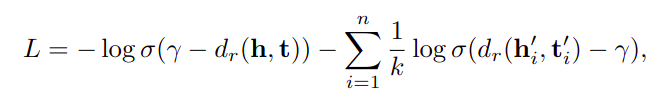
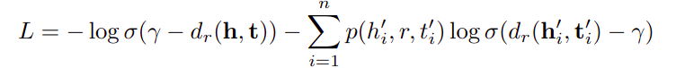

# RotatE技术说明
**前言**：
需要注区别的概念：图嵌入GE和知识图谱嵌入KGE。两者都是建立研究对象的分布式表示，图嵌入重点在于考虑节点在图中的复杂结构信息，偏向度量图结构；知识图谱嵌入重点在处理实体间的显式关系，偏向关系建模。另外，对于图而言，其网络节点之间通常不刻意强调节点之间的差异性；但是知识图谱中的节点之间通常有并列或者上下所属的层次关系。GE和KGE有相似的地方，但是不能混为一谈。

## KGE需要处理的数据典型关系
*对称、非对称关系*：头尾实体交换三元组依然正确的情况，如配偶

*逆关系*：上下位词之间关系，如父亲与儿子

*组合关系*：两种关系的组合为第三种关系，如母亲的丈夫为父亲

## 动机与原理
模型灵感来自于欧拉的恒等式`e^iθ=cosθ+i*sinθ`，这表明复数可以看作是其在复平面中的旋转。 因此模型将实体和关系映射到复矢量空间，并将每个关系定义为从头实体到尾实体的旋转。 给定一个三元组`（h，r，t）`，期望`t =h◦r`，其中`h，r，t∈C`是待训练向量，其中模数`| ri | = 1`，符号`◦`表示Hadamard（按元素）乘积。 具体来说，对于复杂空间中的每个维度，有以下等式成立：

此处模型的优点在于可以同时支持典型关系中的三种关系建模。

## 模型设计
### 距离（打分）函数

> 所有基于平移距离的模型均是对`h,r,t`建立不同的距离公式进行研究的过程。

### 目标函数
损失函数借鉴word2vec训练阶段的优化方式之一：负采样技术，对基于距离的目标函数进行优化，以下是优化前的目标函数：

 

优化后的目标函数：

其中后半部分为负采样的头尾实体，具体做法就是对正确的三元组进行头尾实体的随机替换，并确保替换的三元组不存在已知三元组库中，且其距离函数的结果尽量大。

# 训练调优策略
## 超参搜索方案
实体向量的实部与虚部均进行统一初始化

关系向量统一初始化的到复数空间范围为[0, 2π]

无需正则化，超参数`fixed margin γ`可以有效防止过拟合

| 参数 | 搜索空间 |
|--------|-------|
| embedding_dim `k`| {125, 500, 500, 1000} |
| batch_size `b`| {512,1024,2048} |
| self-adversarial sampling temperature `α` | {0.5,1.0} |
| fixed margin `γ`| {3,6,9,12,18,24,30} |
| negative samples `n`| {64, 128, 256, 512, 1024} |

## 最优参数组合
| Benchmark| embedding_dim `k` | batch_size `b` | negative samples `n` | `α` | `γ` |
|--------|---------|--------|--------|--------| ------|
| FB15k | 1000 | 2048 | 128 | 1.0 | 24 |
| FB15k-237 | 1000 | 1024 | 256 | 1.0 | 9 |
| wn18 | 500 | 512 | 1024 | 0.5 | 12 |
| wn18rr | 500 | 512 | 1024 | 0.5 | 6 |
| YAGO3-10 | 500 | 1024 | 400 | 1.0 | 24 |

# 评估结果
## 通用数据集复现结果
| 数据集| FB15k | FB15k-237 | wn18 | wn18rr | YAGO3-10 |
|--------|---------|--------|--------|--------| ------|
| 实体规模| 14951 | 14541 | 40943 | 40943 | 123182 |
| 关系规模 | 1345 | 237 | 18 | 11 | 37 |
| 关系类型 | 对称、逆关系 | 对称、组合关系 | 对称、逆关系 | 对称、组合关系 | 非对称 |
| MRR | .786 | .336 | .949|.476 | .49 |
| MR | 42 | 178 | 259 | 3342 | 1886 |
| HITS@1 | .732 | .239 | .943 | .428 | .549 |
| HITS@3 | .822 | .375 | .952 | .495 | .674 |
| HITS@10 | .879 | .53 | .959 | .572 | .674 |

## 自建数据集训练结果
| 数据集|cn_baike | cn_bigcilin | cn_military |cn_military(TransE)|
|--------|---------|--------|--------|-----|
| 实体规模| 159387 | 208817 | 28786 | 28786
| 关系规模 | 8695 | 12063 | 116 | 116 |
| MRR | .269 | .267 | .34 | .33 |
| MR | 36215 | 70827 | 3916 | 3448 |
| HITS@1 | .243 | .253 | .295 | .288 |
| HITS@3 | .282 | .274 | .363 | .359 |
| HITS@10 | .316 | .293 | .43 | .436 |

# References
- [TransE论文](https://papers.nips.cc/paper/5071-translating-embeddings-for-modeling-multi-relational-data.pdf)
- [DistMult论文](https://arxiv.org/abs/1412.6575)
- [RotatE论文](https://openreview.net/pdf?id=HkgEQnRqYQ)